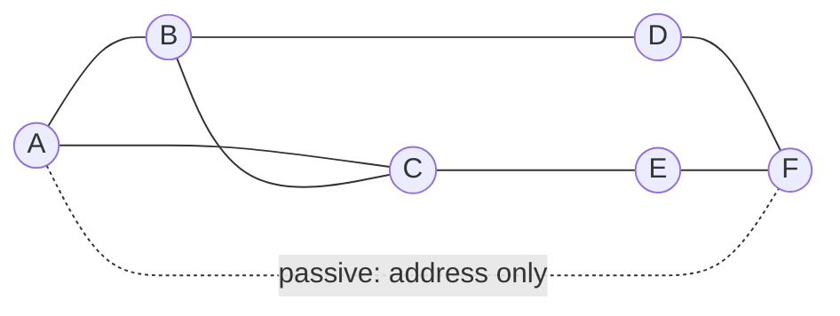
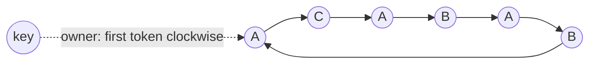
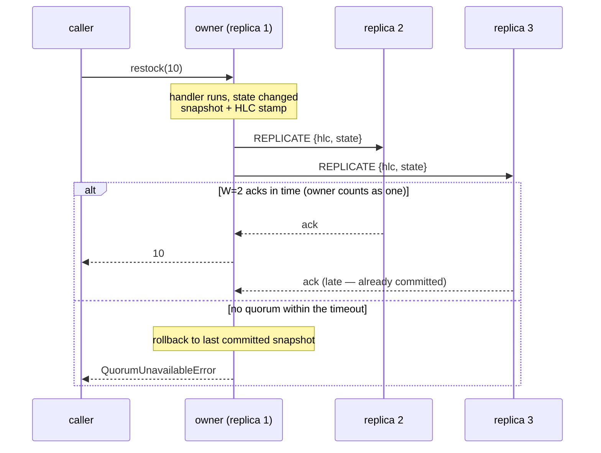
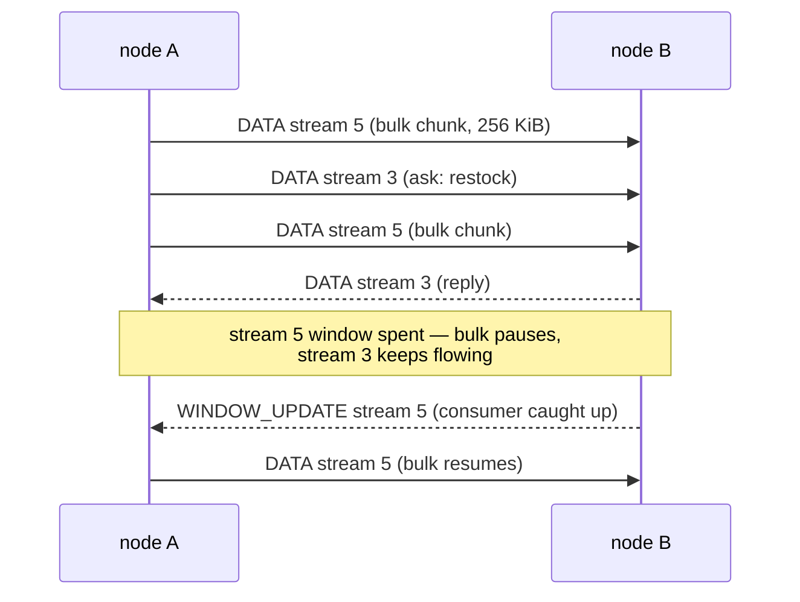

<p align="center">
  
</p>

<p align="center">
  <strong>Typed, clustered actor framework for Python</strong>
</p>

<p align="center">
  <a href="https://pypi.org/project/casty/"></a>
  <a href="https://pypi.org/project/casty/"></a>
  <a href="https://github.com/gabfssilva/casty/actions"></a>
  <a href="https://github.com/gabfssilva/casty/blob/main/LICENSE"></a>
</p>

---

Casty allows you to create actors as plain classes: annotated fields are their state, async methods are their interface. It activates each actor on demand across a leaderless cluster, routes calls to it by key from any node, replicates its state, and survives node failure — while your code stays ordinary typed Python.

```python
import asyncio
import casty


@casty.actor
class Greeter:
    greetings: int = 0

    async def greet(self, who: str) -> str:
        self.greetings += 1
        return f"hello, {who}! (greeting #{self.greetings})"


async def main() -> None:
    async with casty.local() as system:
        greeter = system.actor(Greeter, "front-door")
        print(await greeter.greet("world"))

        # same key -> same activation
        print(await system.actor(Greeter, "front-door").greet("again"))


asyncio.run(main())
```

The same code runs on a cluster — swap `casty.local()` for `casty.start(...)`:

```python
async with casty.start("10.0.0.1:7001", seeds=["10.0.0.2:7001"]) as system:
    greeter = system.actor(Greeter, "front-door")
    # routed to whichever node owns "front-door", from any member
    print(await greeter.greet("world"))
```

The proxy is statically typed: `greeter.greet` has the signature of `Greeter.greet`, and the whole API type-checks under mypy strict.

## Installation

```sh
pip install casty
```

Requires Python 3.12+. Runtime dependency: `msgpack`. Optional compression codecs beyond the built-in zlib:

```sh
pip install "casty[lz4]"    # or casty[zstd]
```

## Three ways to run

```python
system = casty.local()                                   # in-process: no networking, no cluster
system = await casty.start("0.0.0.0:7001", seeds=[...])  # full cluster member: hosts actors
system = await casty.connect(["10.0.0.1:7001"])          # lite member: routes calls, hosts nothing
```

All three share the same API (`actor()`, `map()`, `close()`). The usual form is the async context manager — `async with casty.start(...) as system:` — which closes the system on exit. When the lifetime doesn't fit one block (an application object that owns the system, say), await the call instead, as above, and call `await system.close()` yourself.

`casty.local()` is a complete in-process actor system — mailboxes, lifecycle, supervision — for single-process applications that want the actor model without the cluster. A lite member joins the membership and knows the ring, so it routes calls in one hop, but never owns keys.

## Actors and state

Annotated class fields are the actor's state — the source of truth for snapshots and replication. Fields that shouldn't be persisted (connections, caches) are marked `transient` and rebuilt on activation:

```python
@casty.actor(idle_timeout=300.0)
class Session:
    visits: int = 0                                        # replicated state
    cache: dict[str, str] = casty.transient(factory=dict)  # rebuilt each activation

    @casty.activate
    async def _open(self) -> None:
        self.cache = await load_cache(casty.context().key)

    @casty.deactivate
    async def _close(self) -> None:
        ...  # runs on idle timeout, ctx.deactivate(), or node shutdown

    async def visit(self) -> int:
        self.visits += 1
        return self.visits
```

`@casty.activate` runs on every activation, including reactivation after the actor migrates to another node (state already restored). Inside a handler, `casty.context()` exposes the actor's own key, `ctx.actor(Cls, key)` returns a proxy for actor-to-actor calls (propagating the call chain that reentrancy detection relies on), and `ctx.deactivate()` schedules deactivation after the current message.

Concurrency is the classic actor guarantee: one handler at a time per actor, FIFO mailbox. Reentrancy (an ask cycle A→B→A) is detected and raises `ReentrancyError` instead of deadlocking.

## Schedules

`ctx.schedule` gives an actor deferred and periodic self-calls:

```python
@casty.actor(idle_timeout=float("inf"))
class Monitor:
    checks: int = 0

    async def watch(self, every: float) -> None:
        casty.context().schedule(self._check, every=every)          # periodic
        casty.context().schedule(self._alert, "boot", after=60.0)   # one-shot

    async def _check(self) -> None:
        self.checks += 1

    async def _alert(self, note: str) -> None:
        ...
```

`ctx.emit(self._check)` is the immediate form — the "send to self" of the classic actor model: it enqueues on the actor's own mailbox and returns at once, no reply; the message runs as the next handler. `self._check()` is part of the *current* handler (same commit, same failure); `emit` is the next message, with its own.

A tick is not a callback: it is delivered to the actor's own mailbox and runs like any handler — one at a time, state committed if it mutated, supervised if it raised. Periodic schedules are fixed-delay (the next tick arms only after the previous one finished, so a slow handler never piles ticks up), and `Schedule.cancel()` stops one early.

Schedules are bound to the activation: they die on deactivation — whatever the reason — and never keep an actor alive or reactivate one. An actor that must keep ticking across node failure combines this with replication and infinite idle (`replicas=3, idle_timeout=float("inf")`): the cluster reactivates such an actor on the new owner unprompted, its activate hook runs again, and the canonical idiom re-arms the schedule from replicated state — the decision is a state field, the schedule its transient effect.

## Messages

Arguments and return values must be serializable. Built-ins (numbers, strings, lists, dicts, ...) work as-is; your own types are declared with `@casty.message`:

```python
@casty.message
class Reservation:
    order_id: str
    qty: int
```

`@casty.message` turns the class into a slotted dataclass and registers it under a stable wire name (default `module.QualName`, overridable with `name=...`). Serializability is validated recursively at import time, not at send time. Schema evolution is tolerant in both directions: new fields with defaults are accepted by old receivers, unknown fields are ignored.

## Clustering

Nodes are homogeneous — there is no leader. Start one node, point the others at it:

```python
system_a = await casty.start("10.0.0.1:7001")
system_b = await casty.start("10.0.0.2:7001", seeds=["10.0.0.1:7001"])
system_c = await casty.start("10.0.0.3:7001", seeds=["10.0.0.1:7001"])
```

Every key is owned by exactly one node, determined by a token ring that every member computes locally — placement needs no coordinator and no extra hops. Calls route directly to the owner regardless of which node dispatches them.

When a node joins or leaves, only the affected key ranges move. `system.close()` is graceful: it drains in-flight handlers, hands its ranges off to the new owners, and announces a clean leave — a rolling restart doesn't stampede the cluster.

TLS (including mTLS) is one argument away:

```python
async with casty.start(
    "0.0.0.0:7001",
    seeds=[...],
    tls=casty.TLS(cert="node.pem", key="node.key", ca="ca.pem"),
) as system:
    ...
```

Every timeout, view size and protocol interval is a knob with a documented default: `casty.start(..., config=casty.Config(...))`.

## Replication and consistency

By default an actor lives in a single copy: fast, and its state dies with its node. Classes that need durability declare replication:

```python
@casty.actor(replicas=3, write=casty.MAJORITY)
class StockItem:
    on_hand: int = 0

    async def restock(self, qty: int) -> int:
        self.on_hand += qty
        return self.on_hand
```

After every handler that mutates state, the owner snapshots the annotated fields, stamps them with a hybrid logical clock, and pushes to the backup replicas; the caller gets its answer once `write` replicas have acknowledged. `write` and `read` take `casty.ONE`, `casty.MAJORITY`, `casty.ALL`, or an integer. In v1 a read is served from the owner's in-memory state, kept correct by fencing and by the activation handshake — which does read from a quorum and repairs stale replicas along the way; per-method quorum reads are deferred.

If the owning node dies, the next call activates the actor elsewhere from the newest committed snapshot. Split-brain is handled by fencing: an owner that cannot reach a write quorum rejects writes with `QuorumUnavailableError` rather than diverging.

## Failure handling

Two failure domains, kept apart:

**Infrastructure failures** — timeout, unreachable owner, no quorum, a range mid-migration — surface as typed exceptions on the *caller*: `CastyTimeoutError`, `ActorUnavailableError`, `QuorumUnavailableError`, `RangeMovingError`, `UnknownActorTypeError`. Retries happen automatically only where provably safe (re-routing after a view change); everything else propagates.

**Actor failures** — an exception inside a handler — are decided by the *supervisor*, a plain function. It is not an Erlang supervision tree — virtual actors have no parent that created them; it is a policy for the fate of the activation:

```python
def three_strikes(
    cls: type, key: str, exc: Exception, ctx: casty.FailureContext
) -> casty.Directive:
    return casty.KEEP if ctx.failures < 3 else casty.RESET


async with casty.start("0.0.0.0:7001", supervisor=three_strikes) as system:
    ...
```

- `KEEP` (default): state survives; the caller gets `ActorFailedError` wrapping the original exception.
- `RESET`: the activation is discarded; the next call starts from the last replicated snapshot (or fresh).
- `STOP`: graceful deactivation; the next call reactivates.

The global supervisor can be overridden per class: `@casty.actor(supervisor=...)`.

## Collections

Distributed collections are sugar over the same machinery — each one is a set of shard actors, placed and replicated like any other actor, behind a typed facade. There is no new mechanism: placement, replication, quorum and fencing are exactly those of the actor layer, and every factory takes the same `(replicas, write, read)` triple.

```python
prices: casty.Map[str, float] = system.map("prices", replicas=3, write=casty.MAJORITY)

await prices.put("sku-1234", 49.90)
print(await prices.get("sku-1234"))
print(await prices.size())
```

Three families:

- **Sharded by item** — `map()`, `set()`, `multimap()`. Single-item operations route by item hash to one of `shards` shard actors (default 32); aggregations (`size()`, `items()`) fan out to every shard in parallel. They scale with the number of shards and nodes.
- **Striped** — `counter()`. A single logical value split into stripes so writes don't hotspot one owner: `add` lands on a rotating stripe, `get` sums the fan-out.
- **Single-owner** — `register()` (atomic ref with compare-and-set), `queue()` (FIFO), `semaphore()` and `lock()`. Ordering and unique identity require serialization on a single owner, so these don't scale within one instance — scaling is many named instances. The single writer is also why CAS on the register is correct for free.

`Semaphore` permits are leases: `acquire` returns a `Lease` carrying a TTL and a monotonically increasing fencing token; the holder renews before expiry or the permit is reclaimed. Replication covers the owner node dying; the TTL and the fencing token cover the *client* holding the lease dying. `Lock` is `Semaphore(capacity=1)` with an async context manager:

```python
async with system.lock("migrations", timeout=30.0):
    ...  # held cluster-wide; released on exit
```

Under the hood a collection introduces nothing: its shards are ordinary actors whose wire name encodes the replication triple (`casty.MapShard[r3,wmajority,rdone]`), so any node that receives a call can materialize the shard class on the spot — the factory doesn't need to have run everywhere. Shards store encoded bytes and the typed facade does the encoding, which is why keys, values and elements never need registering as messages, and why `casty.Map[str, float]` still type-checks `put`/`get` statically. Lite members get the same facades and route like any actor call.

## Streaming

Actor methods can take and return `AsyncIterator[T]`. Elements cross the network lazily over the transport's flow-controlled streams, so backpressure is end to end — a slow consumer throttles the producer, with no intermediate buffer:

```python
from collections.abc import AsyncIterator


@casty.actor
class Log:
    entries: list[str] = dataclasses.field(default_factory=list)

    async def tail(self, since: int) -> AsyncIterator[str]:          # server-streaming
        for entry in self.entries[since:]:
            yield entry

    async def ingest(self, lines: AsyncIterator[str]) -> int:        # client-streaming
        count = 0
        async for line in lines:
            self.entries.append(line)
            count += 1
        return count

    async def lengths(self, lines: AsyncIterator[str]) -> AsyncIterator[int]:  # duplex
        async for line in lines:
            yield len(line)
```

```python
log = system.actor(Log, "app:1")

count = await log.ingest(source())      # upload an iterator, get a scalar back
async for entry in log.tail(0):         # consume with async for
    ...
async for n in log.lengths(source()):   # iterator in, iterator out
    ...
```

A streaming method is an ordinary handler: it holds its actor for the stream's lifetime — no other call to that key progresses until it finishes — and commits its state once, on return, exactly like a unary handler. So an `ingest` folds the whole upload into state atomically, and a `tail` that mutates nothing replicates nothing.

On the wire a streaming call opens a dedicated stream toward the key's owner: the scalar arguments travel once at open, each element is one frame, and each side half-closes when its iterator is exhausted. Failures arrive in-band as the same typed exceptions as a normal call; if the ring moved, the open is retried once — safe, since no element was processed yet — but after the first element the stream is stateful and any interruption is terminal. Killing the owner mid-stream raises in the caller's `async for`; a caller that `break`s cancels the handler on the owner. There is no resume — reopen from scratch if you want to.

## Services

An actor serializes: one handler at a time, so a handler awaiting slow I/O holds the mailbox for the whole wait. That is the actor's state guarantee — and its concurrency ceiling. A **service** removes the ceiling without taking the actor out of the path: `@casty.service` generates an actor whose handler fires the method as a task and returns immediately, so N calls to the same service progress together:

```python
@casty.actor
class Inventory:
    stock: int = 10

    async def reserve(self, qty: int) -> bool:
        if qty > self.stock:
            return False
        self.stock -= qty  # serial per sku: never sells what it does not have
        return True


@casty.service(concurrency=32)
class Checkout:
    async def buy(self, sku: str, qty: int) -> bool:
        await charge_card(sku, qty)  # slow I/O, runs concurrently
        return await casty.context().actor(Inventory, sku).reserve(qty)


checkout = system.service(Checkout)  # no key — proxy typed as Checkout
results = await asyncio.gather(*[checkout.buy("sku-1", 1) for _ in range(12)])
```

A service is stateless by construction — a state field on the class is an import-time error — and unplaced: no key, no ring position. `node.service(Cls)` dispatches to a local activation with zero hops; a lite member load-balances across members. State lives in the actors the method calls, and calls with the same `(actor, key)` stay serialized there: the service is the concurrent door; the actor, the serial guardian.

Underneath, the generated handler does three O(1) things: registers the caller's pending reply, fires the method as a task, and hands the mailbox back. The reply resolves when the task finishes, and an activation with work in flight refuses to idle out, so a pending reply is never dropped by deactivation. `concurrency=` bounds in-flight tasks per activation with real backpressure — above the limit, requests wait in the mailbox. On shutdown the tasks are cancelled and every pending caller gets `ActorUnavailableError`: in-flight work doesn't survive, consistent with a service holding no state.

## Paged state

A replicated actor normally ships its whole state on every mutating handler — fine for kilobytes, hopeless for a 96 MB DataFrame. Paged state splits the state into pages and replicates only what the handler touched. The regime is decided per field, statically, from its type:

| regime | when | page |
|---|---|---|
| **integral** | default | 1 per field — re-encoded and compared against the last commit |
| **dict-tracked** | `dict[K, V]`, `V` immutable, empty default | 1 per entry — a wrapper marks touched keys |
| **pager** | field declared with `casty.paged(pager)` | defined by the pager |

```python
import pandas as pd
from casty.pagers import PandasPager


@casty.actor(replicas=3, write=casty.MAJORITY)
class Telemetry:
    readings: pd.DataFrame = casty.paged(PandasPager())
    revision: int = 0  # ordinary integral field, committed alongside the frame

    async def correct(self, row: int, sensor: str, value: float) -> None:
        self.readings.loc[row, sensor] = value
        self.revision += 1
```

`PandasPager` (extra `casty[pandas]`, pandas ≥ 3.0) detects the changed cells through pandas' copy-on-write and ships only the moved Arrow blocks. Measured on the in-process test cluster:

| state | commit | wire (2 replicas) | integral would be |
|---|---|---|---|
| 100k entries (`dict[str, int]`, 360 KB) | mutates 1 entry | **514 B** | ~740 KB |
| 2.5M x 5 float64 (96 MB) | edits 1 cell | **258 KB** | 192 MB |
| 65 KB (3 fields) | mutates 1 `int` field | **504 B** | ~131 KB |

`casty.explain(Actor)` prints the regime of every field, so two regimes chosen by type hint are never invisible. How the pages stay consistent across replicas — deltas, catch-up, atomicity — is under *How it works* below.

## Inspection

Every handler execution emits lifecycle events — `Activated`, `Received`, `Completed`, `Failed`, `Deactivated` — born on the node that runs the handler, with an exact per-activation sequence number. Two consumers, opposite trade-offs:

**Interceptor** — a sync callable passed to `start`/`local`, like `supervisor`. It runs inline in the actor's worker, so delivery is guaranteed and ordered — and its cost is the actor's cost. The contract is "return fast, never block, never raise" (a raise is logged, never fails the handler). This is the hook for metrics:

```python
from casty import inspection


def metrics(event: inspection.SpyEvent) -> None:
    match event:
        case inspection.Completed(actor=actor, method=method, duration=d):
            histogram(f"{actor}.{method}").observe(d)
        case inspection.Failed(actor=actor, method=method):
            counter(f"{actor}.{method}.errors").inc()
        case _:
            pass


node = await casty.start("0.0.0.0:7001", interceptor=metrics)
```

**Spy** — a decoupled, lossy subscription for debugging and auditing. Selectors are `fnmatch` globs matched at the emitting node, so only matching events cross the wire; `scope="cluster"` dials every member and merges, `payloads=True` ships args/results (decode with `inspection.decode`). Observation never slows an actor: every buffer drops oldest on overflow and surfaces the loss in-band as `Lag`.

```python
async with system.spy(Order, key="order-*", scope="cluster") as events:
    async for event in events:
        match event:
            case inspection.Received(key=key, method=method): ...
            case inspection.Lag(dropped=n): ...
```

`system.state_of(Order, "order-42")` reads an activation's live serializable state without going through the mailbox — a point-in-time debugging read, `None` when the key is not currently activated.

## How it works

The machinery, layer by layer: membership (who is in the cluster), placement (which node owns a key), replication (how state survives failures) and its paged variant (how that stays cheap when state is large), and transport (how bytes move between nodes).

### Membership

Membership combines three protocols from the gossip literature: **HyParView** for the overlay topology, **Plumtree** for broadcast, and **SWIM**-style suspicion for failure detection. Every node keeps a full copy of the member list — there is no central registry — and these three keep the copies converged while nodes join, leave, and die.

**HyParView** decides who talks to whom. A full mesh doesn't scale and a fixed topology is fragile, so each node keeps two partial views: a small **active view** — a handful of open TCP connections, the edges of the overlay — and a larger **passive view** of addresses held in reserve, refreshed by periodic shuffles. The theory is random-graph connectivity: a graph where every node keeps a few random edges is connected with overwhelming probability, and stays connected if failed edges are promptly replaced — which is what promotion from the passive view does. Each node pays for ~5 connections instead of N, and the overlay survives a large fraction of the cluster failing at once. Joining is dialing any existing member: the join request random-walks through the overlay, and the nodes it lands on adopt the newcomer.



Solid edges are active links — the overlay itself, carrying gossip and failure detection. The dashed edge is passive knowledge: A holds F's address as a promotion candidate but keeps no connection to it.

**Plumtree** decides how a cluster event — joined, left, dead — reaches everyone. Naive flooding (forward everything to every neighbor) is robust but redundant: each node receives each event once per neighbor. A spanning tree is optimal — each node receives each event exactly once — but one dead branch cuts part of the cluster off. Plumtree runs both at once: full events are pushed on **eager** links, only event ids on **lazy** links. A duplicate delivery demotes the sending link to lazy (*prune*); an id heard with no payload arriving within a timeout is requested from the announcer, and that link is promoted to eager (*graft*). The eager links converge to a broadcast tree, and the lazy ids are the repair signal that regrows it around failures.

**SWIM**'s suspicion mechanism decides when a node is dead. In an asynchronous network a dead node and a slow one are indistinguishable, so no single observation is allowed to kill: losing the connection to an active neighbor only gossips a *suspicion*. Every membership record carries an **incarnation number** — a live node that hears itself suspected increments its incarnation and broadcasts a refutation, which overrides the suspicion on every node (higher incarnation wins the merge). Only a suspicion left unrefuted past a timeout becomes DEAD. One dropped connection or a GC pause doesn't evict a node; failing to refute does. Suspicion only ever originates from overlay neighbors — a dropped data-path connection between two nodes that aren't neighbors says nothing about liveness and raises nothing.

Underneath the three protocols sits the member table: one record per member — address, incarnation, and a status of ALIVE, SUSPECT, DEAD or LEFT. Any two copies of the table merge deterministically: a higher incarnation wins outright, and on a tie the more severe status does (`DEAD > LEFT > SUSPECT > ALIVE`). That merge rule is what makes the whole design tolerant of gossip delivering events twice, late, or out of order — every path converges to the same table — and the case gossip misses entirely is repaired by **anti-entropy**: periodically, and on every new link, a node exchanges its full table with a neighbor. The same exchange doubles as the bootstrap that hands a joiner the cluster's state. Records of dead and departed nodes are kept as tombstones for a while, precisely so that a delayed rumor cannot resurrect them.

Leaving is cheap on purpose. A departing node broadcasts a leave and its peers mark it LEFT with no suspicion window — a rolling restart never looks like a failure. A node that finds itself isolated (its active view empties, or it discovers the cluster thinks it's dead) re-joins through any address it remembers and refutes with a higher incarnation; the same anti-entropy that bootstraps a joiner brings it back.

### Placement

Placement is **consistent hashing**, in the token-ring-with-vnodes form popularized by Amazon's Dynamo and adopted by Cassandra and Riak. Given the member list, every node must resolve any key to its owner — all agreeing — without asking anyone.

The obvious scheme, `hash(key) mod N`, reshuffles nearly every key whenever N changes. Consistent hashing avoids that by hashing nodes and keys into the *same* space, treated as a circle: each node hashes its id to positions on the circle (its tokens), a key hashes to a point, and the owner is the node holding the first token clockwise from that point. Ownership is defined by adjacency on the circle, not by N — a joining node claims only the arcs immediately behind its new tokens, a leaving node donates its arcs to its clockwise successors, and the fraction of keys that moves is ≈1/N, the minimum possible.

One token per node would split the circle unevenly, and a join would relieve only one neighbor. So each node takes 128 tokens — *vnodes* — chopping the circle finer: load evens out statistically, and the ranges a node absorbs or hands off are spread across the whole cluster. Replicas are the next *distinct physical* nodes continuing clockwise from the owner — distinct matters, because consecutive tokens are often vnodes of the same node, and skipping them is what puts replicas on different machines.



The circle, unrolled: three nodes (A, B, C), two vnodes each shown. The key's hash lands between B's and A's tokens, so A owns it. With `replicas=3`, the walk from the owner collects distinct nodes — A (owner), C, then B; the second A token along the way is skipped.

The ring is a pure function of the member list: same members in, same ring out. Every node therefore computes any key's owner locally, in zero hops — no coordinator, no lookup table, no placement service to keep consistent. Membership convergence is what carries placement convergence: nodes that agree on the member list agree on every key's owner.

Two details are protocol, not implementation. The hash is truncated blake2b — a fixed function of node id and vnode index for tokens, of the key string for lookups — because every node must compute the identical ring across processes, platforms and versions (Python's builtin `hash()` is salted per process and can never appear here), and the vnode count is a cluster-wide constant for the same reason. And the unit everything else moves is the **token range** — the arc between two adjacent tokens: handoff and replication deal in ranges, not individual keys, and the minimal-movement property holds by construction — adding a node moves keys only *to* it, removing a node moves only the keys that were *its*.

### Replication

Replication is **primary-based** — a single writer per key — with **quorum-acknowledged writes** and versions ordered by a **hybrid logical clock (HLC)**. There is no consensus protocol (no Raft, no Paxos); safety comes from quorum intersection and fencing.

An actor declared with `replicas=R` keeps its state on R nodes: the owner plus the next R−1 on the ring. Only the owner runs handlers and mutates state, so each key's history is one chain of snapshots — no concurrent versions, hence no vector clocks and no merge functions. The chain is ordered by the HLC: physical clocks skew and jump backwards, and purely logical clocks bear no relation to real time; a hybrid clock tracks wall time but is guaranteed monotonic, so "highest stamp" reliably names the newest snapshot of a key.

After each handler that changed state, the owner snapshots the fields, stamps the snapshot, and pushes it to the backups. The caller gets its reply once `write` replicas have acknowledged (the owner counts as one). Fewer than W acks within the timeout → the owner rolls its in-memory state back to the last committed snapshot and raises `QuorumUnavailableError`. Quorums are counted against the configured R, never against however many nodes the owner currently sees — an owner isolated in a minority cannot decide its view "shrank" and keep committing. That is the CAP tradeoff made explicit: under a partition the minority gives up availability (rejects writes) so the majority side can elect a new owner and continue without diverging.



Recovery rests on the classic quorum-intersection argument. A committed write reached W of the R replicas, and with `write=MAJORITY` any two groups of W replicas share at least one node. So when a call arrives for an actor that isn't active — first use, or its owner died — the ring names the new owner, which queries the replicas and waits for W responses before activating: the intersection guarantees the newest committed snapshot is among them. The owner adopts the highest stamp and repairs any replica that answered with something older (read repair).

Under divergent views (mid-partition), two owners can activate briefly — but at most one can assemble a write quorum. The other's first write is rejected by replicas that have already acknowledged a newer chain; it discards its activation and the call retries against the surviving owner — a retry that is safe because the rejected write was applied nowhere. Exactly-one activation is therefore eventual rather than absolute — the tradeoff for not running a consensus protocol. The write guarantee is never violated: an acknowledged write is on W replicas and cannot be silently overwritten.

Two details round the model out. A handler that changed nothing costs nothing: the owner compares the would-be snapshot against the last committed one and skips replication entirely, so reads and no-op writes never touch the network. And the range handoff a closing node performs is an optimization, not a durability requirement — every acknowledged write already lives on W replicas, so handing the state to the next owners merely spares them the fetch and shortens the reactivation window.

### Paged replication

Integral snapshots stop working when state gets big: encoding is O(state) on every commit, and one snapshot bigger than the message cap would have to be rejected. So what actually replicates is not a snapshot but a set of **pages**: one per field by default, one per entry for tracked dicts, one per data block for pager fields. A page key is hierarchical (`field`, `field/entry`, `field/column/block`), an absent page means "the field's default" — a field that never left its default costs nothing on the wire — and every page remembers the commit that wrote it. The commit that follows a handler carries only the pages that changed, plus the keys that were dropped, all under one HLC stamp.

Deltas introduce a correctness rule that integral snapshots never needed: **a delta only applies over the basis it was computed on**. Each commit declares the owner's previous HLC, and the replica compares it against its own. If the replica is *newer*, the owner is stale — it lost writes to another owner after a partition — and the answer is a NACK that makes the owner discard its activation (this is fencing, same as before, just detected at the page level). If they're *equal*, the delta applies. If the replica is *older* — it missed a commit, which W-of-R acks explicitly allow — it must not apply the delta over the wrong basis and silently diverge; it NACKs, and the owner responds by resending the complete page set. That answer is self-healing (one extra round trip on the first write after a gap, then back to deltas) and it removes any need for the owner to track what each replica has: the replica's check is the truth. Deletions ride inside the delta, so nothing requires tombstones — the owner's page index is always authoritative.

The other question deltas raise is how mutations are *detected*, and the design rule is uniform: a false positive (replicating something unchanged) is acceptable; a false negative (missing a mutation) never is. Integral fields are re-encoded and byte-compared — always correct, costs the encode. Tracked dicts are wrapped so every mutator marks the touched key — one page per entry, and reassigning the whole dict just re-arms the wrapper. Pager fields delegate to a library-specific diff: `PandasPager` exploits pandas' copy-on-write, where any write path whatsoever copies the underlying block, so a moved buffer address is proof of a write and an unmoved one is proof of none. Deep write-intercepting proxies were evaluated and rejected on the same rule: C extensions mutate buffers underneath Python interception, and a missed write would be silent corruption. Dicts of *mutable* values fall back to integral for exactly that reason.

Commits too big for one message are split into parts sharing the same HLC, and a replica publishes only when the final part arrives — it never exposes half a commit, and the fencing check runs on every part so a stale owner fails fast. Activation reuses the page index: replicas answer with what they hold and at which commit, the new owner adopts the newest quorum-confirmed version and fetches only the pages it doesn't already have — reactivating on a node that was already a replica fetches nothing. Read repair, likewise, sends a lagging replica exactly the pages where it diverges.

### Transport

Transport is a **multiplexed binary protocol over TCP, following the yamux design** (HashiCorp's mux, run under Consul and Nomad for a decade), with **credit-based per-stream flow control** — the same scheme HTTP/2 uses. One connection per node pair, TLS or mTLS optional.

Multiplexing exists to defeat head-of-line blocking. A TCP connection is a single ordered byte stream: whatever is queued ahead of a message delays it, so a multi-gigabyte state handoff sharing the pipe with actor calls would stall them for its whole duration. The mux splits the connection into independent streams and caps frames at 256 KiB; streams interleave at frame granularity, so the bulk transfer becomes thousands of frames with other streams' frames slotted between them, and the most it can delay an actor call is one frame.

Per-stream flow control exists because TCP's own backpressure is per-connection: one slow reader would stall everything sharing the pipe. Each stream instead carries its own credit window — the receiver grants bytes, the sender stops when they are spent, and credit returns as the receiver actually consumes. A slow consumer stalls exactly one producer, its own, while everything else keeps flowing.



One connection, two streams: an actor ask (stream 3) slots between the chunks of a bulk transfer (stream 5) and gets its reply while the bulk is still running; when the bulk consumer falls behind, the spent window pauses that stream alone until credit comes back.

Every connection carries the same standard channels: a control channel for the handshake and then membership gossip, a message channel for actor calls, a lane reserved for replication — so state fan-out and actor traffic never contend for the same window — and ephemeral streams for bulk transfers and actor streaming. Within a channel, messages delimit themselves and carry a correlation id; replies arrive asynchronously and out of order, as the actor model dictates. Messages are capped at a few MiB — anything larger is by definition a bulk transfer and gets its own stream.

The connection is the unit of sanity. A protocol violation — an unknown frame, data past the granted window, a corrupt length — is a bug, not a condition to recover from, so the connection dies rather than "repairing" a corrupted stream; an application error aborts only its own stream. There is one connection per node pair (a simultaneous open from both sides resolves deterministically, no negotiation), idle connections are kept alive by pings — whose failure doubles as the suspicion signal for membership — and the transport itself never retries anything: whether a retry is safe is a correctness question that belongs to the layers above.

Connections open on demand, directly between caller and owner; the gossip overlay carries only membership traffic, so the control plane and the data plane stay separate. Reconnection uses exponential backoff with jitter. The handshake checks cluster name and protocol version and negotiates a compression codec per connection; payloads are compressed only above a size threshold, since small latency-sensitive actor messages lose more than they gain.

## Design

Casty is built on a single primitive: the virtual actor. An actor's identity is a pair — class and key — and the identity is permanent while every process serving it is ephemeral: the actor activates on whichever node owns its key the moment a call arrives, deactivates when idle, and reactivates somewhere else if its node disappears. Everything else the library offers — maps, counters, queues, locks, services, streaming — is sugar over that primitive. This keeps the mental model small: understand what one actor guarantees, and you understand what everything built on top of it guarantees.

The cluster is leaderless as a matter of principle. Nodes are homogeneous and nothing is ever elected: where a "primary" is required — replication has a single writer per key — the role falls out of position on the token ring, so authority moves when the membership view moves, with no election protocol to run and no consensus service to operate. The design targets hundreds of nodes, and every timeout, view size and protocol interval is a configuration knob with a documented default rather than a constant.

The consistency model follows from the single writer. Since only a key's owner ever mutates its state, each key's history is one chain of versions — vector clocks and merge functions have no job to do, and a hybrid logical clock suffices to name the newest version. CRDTs were left out for the same reason: they solve concurrent multi-writer merges, which is exactly the situation the single-writer design prevents from arising. What replicates is the state itself, committed after each handler that mutated it. Replicating the operations instead — a method log — was considered and rejected: replaying a log requires deterministic handlers, a constraint that contaminates the entire programming model, while replicating state can only err on the side of shipping too many bytes, and paged replication exists to bring the bytes back down. Split-brain is answered with fencing rather than consensus: an owner that cannot assemble a write quorum rejects the write. The consequence is that "exactly one activation" is eventual rather than absolute — a duplicate owner born of a divergent view is detected on its first write and resolved by the clock — which is the deliberate price of not running Raft or Paxos.

Static typing runs end to end. An actor is a plain class and its proxy is typed as that class; wire formats are dataclasses registered under stable names, so a class can be renamed without breaking the wire; serialization is msgpack over schemas validated recursively at import time, so an illegal type surfaces when the module loads, not when a message is sent; and pickle appears nowhere, on any path. Actor state rides the same machinery — the snapshot of the annotated fields is itself a registered message. The decorated classes are slotted, so assigning an undeclared attribute raises immediately instead of creating state that would silently never replicate.

One premise is explicit: every member runs the same application code. Casty never ships code across the cluster; a call for a class the destination doesn't know fails with `UnknownActorTypeError` at the caller. Rolling out a new actor type therefore means deploying the type to every node before its first use.

`casty.local()` is a complete in-process actor system — mailboxes, lifecycle, supervision — but it is not a one-node cluster, and the two are kept distinct on purpose. Under local mode, `replicas > 1` runs as a single copy: no quorum, no durability. A real one-node cluster would instead fence replicated writes with `QuorumUnavailableError` whenever the configured quorum needs more nodes than exist. Local mode is for applications that want the actor model without the cluster, not for simulating one.

The operational surface is deliberately small. Shutdown is a drain — stop accepting work, finish in-flight handlers, hand ranges off to the new owners, announce a clean leave — because a deploy must not look like a failure or set off a reactivation storm; node, client and local mode all close the same way, and all are async context managers. Observability is structured logging plus a pluggable metrics protocol, no-op by default: no dashboard, no bundled dependency. The single runtime dependency is msgpack — compression codecs beyond zlib and the pandas pager are optional extras — and the toolchain is uv, mypy strict, ruff and pytest.

## Examples

Runnable, numbered walkthroughs in [`examples/`](examples/):

1. [Hello world](examples/01_hello_world.py) — one node, one actor, one call
2. [Lifecycle](examples/02_lifecycle.py) — transient state, hooks, idle deactivation
3. [Cluster](examples/03_cluster.py) — three nodes, ring placement, lite member
4. [Supervision](examples/04_supervision.py) — KEEP / RESET / STOP with a custom policy
5. [Replicated inventory](examples/05_replicated_inventory.py) — quorum writes surviving node loss, distributed map
6. [Streaming](examples/06_streaming.py) — server-, client- and duplex streaming with end-to-end backpressure
7. [Service](examples/07_service.py) — concurrent RPC fanning out to a serial, stateful actor
8. [Paged DataFrame](examples/08_paged_dataframe.py) — cell-level edits to a 305 MiB frame, kilobytes on the wire (needs the pandas extra)
9. [Reactivation](examples/09_reactivation.py) — a replicated, infinite-idle actor resuming on the new owner after its node dies
10. [Schedule](examples/10_schedule.py) — periodic and one-shot self-calls, re-armed across failover
11. [Inspection](examples/11_inspection.py) — inline interceptor, cluster-scope spy with payloads, `state_of`

```sh
uv run python examples/01_hello_world.py
```
