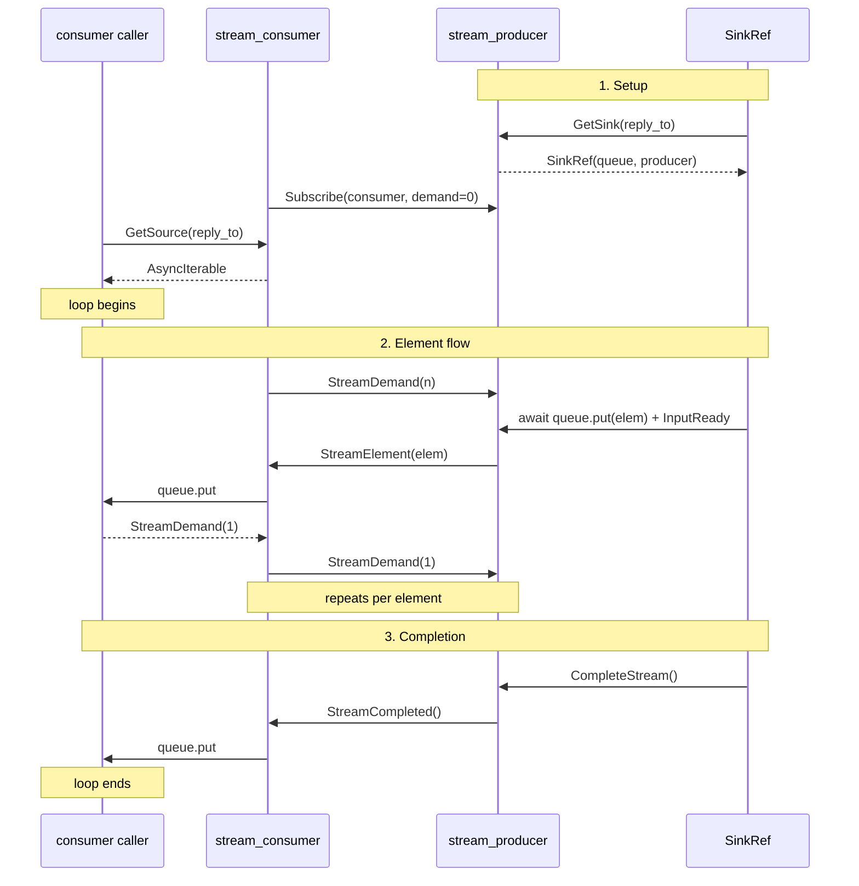

# Reactive Streams

In this guide you'll build a **price feed pipeline** that pushes stock prices through a demand-gated stream. Along the way you'll learn how `stream_producer` and `stream_consumer` implement backpressure, how `SinkRef` provides input-side backpressure, how the consumer exposes an `async for` iterator, and how `break` triggers deterministic cleanup across the pipeline.

## The Problem

An actor producing data faster than its consumer can handle needs backpressure — a way for the consumer to say "send me N more". Without it, buffers grow unbounded or messages get dropped. Casty's reactive streams solve this with two cooperating behaviors: a **producer** that buffers elements and respects demand, and a **consumer** that mediates between the producer and an async iterator.

The input side has the same problem: a fast caller can overwhelm the producer's buffer. `SinkRef` solves this — it wraps the producer's bounded queue and blocks when full.

## The Data

A simple frozen dataclass for price updates:

```python
--8<-- "examples/guides/10_streams.py:29:32"
```

## Setting Up the Pipeline

The producer and consumer are regular actors — spawn them, wire them together:

```python
--8<-- "examples/guides/10_streams.py:35:41"
```

`stream_producer(buffer_size=16)` starts idle with a bounded internal queue. `stream_consumer(producer)` subscribes on setup and waits for a `GetSource` request. `initial_demand=2` means the consumer will request 2 elements at a time — the producer won't send more than 2 without further demand.

## Getting a SinkRef and SourceRef

Ask the producer for a `SinkRef` and the consumer for a `SourceRef`:

```python
--8<-- "examples/guides/10_streams.py:43:49"
```

`SinkRef` wraps the producer's internal `asyncio.Queue`. Calling `await sink.put(elem)` pushes an element into the queue and nudges the producer to drain it. If the queue is full (`buffer_size` reached), `put` blocks until the consumer drains elements — input-side backpressure with zero configuration.

## Concurrent Push and Consume

Push and consume run concurrently — streams can be infinite:

```python
--8<-- "examples/guides/10_streams.py:53:68"
```

The consumer starts iterating immediately. Elements flow as they're pushed — no need to complete the stream first. `sink.complete()` signals the end, the consumer's `async for` exits, and the task finishes.

Output:

```
── Pushing 5 prices into producer ──
── Consuming via async for (initial_demand=2) ──
  #1 AAPL: $142.50
  #2 AAPL: $143.10
  #3 AAPL: $141.80
  #4 AAPL: $144.20
  #5 AAPL: $145.00

── Stream complete: 5 prices received ──
```

All five prices arrive in order despite `initial_demand=2` — demand replenishment keeps the pipeline flowing.

## Early Cancellation

`break` out of an `async for` and the stream cleans up automatically. The iterator's `finally` block sends `StreamCancel` through the consumer to the producer, which stops:

```python
--8<-- "examples/guides/10_streams.py:71:103"
```

Output:

```
── Early break: take 5 from 20 ──
  Took: [0, 1, 2, 3, 4]
  Stream cancelled — producer stopped via StreamCancel
```

The same cleanup happens on `return`, unhandled exceptions, or inactivity timeout. The producer is always notified.

## How It Works

The data flow has three directions:

**Input (elements):** `await sink.put(elem)` → producer's `asyncio.Queue` → blocks at `buffer_size`.

**Forward (elements):** queue drains → `StreamElement` → consumer's asyncio queue → `async for` yields.

**Backward (demand):** `async for` consumes → consumer sends `StreamDemand(1)` → producer flushes next element from queue.

The producer sends `StreamElement` and `StreamCompleted` to the consumer actor's own ref. The consumer receives them in its mailbox and forwards them to an internal queue that the `async for` reads from. Everything goes through actors — no side channels.



## Cross-Node Streams

`SinkRef` and `SourceRef` both wrap in-process queues, but they work seamlessly across nodes — each one lives on its respective actor's node:

- **Node A** (producer side): obtain `SinkRef` via `GetSink`, push elements locally
- **Node B** (consumer side): obtain `SourceRef` via `GetSource`, iterate locally

The cross-node communication flows through actor messages (`Subscribe`, `StreamDemand`, `StreamElement`, `StreamCompleted`) — the same protocol that powers single-node streams. No special configuration needed.

## Run the Full Example

```bash
git clone https://github.com/gabfssilva/casty.git
cd casty
uv run python examples/guides/10_streams.py
```

---

**What you learned:**

- **`SinkRef`** wraps the producer's bounded queue — `await sink.put(elem)` blocks when full, providing input-side backpressure.
- **`stream_producer(buffer_size=N)`** creates a bounded internal queue. `buffer_size=0` means unbounded.
- **`stream_consumer`** subscribes to a producer and exposes the stream as an `SourceRef` via `GetSource`.
- **Push and consume run concurrently** — streams can be infinite, no need to complete before consuming.
- **Demand is automatic** — each consumed element replenishes demand one-for-one.
- **`break`, `return`, and exceptions** all trigger `StreamCancel` via the async generator's `finally` block — deterministic cleanup with no manual resource management.
